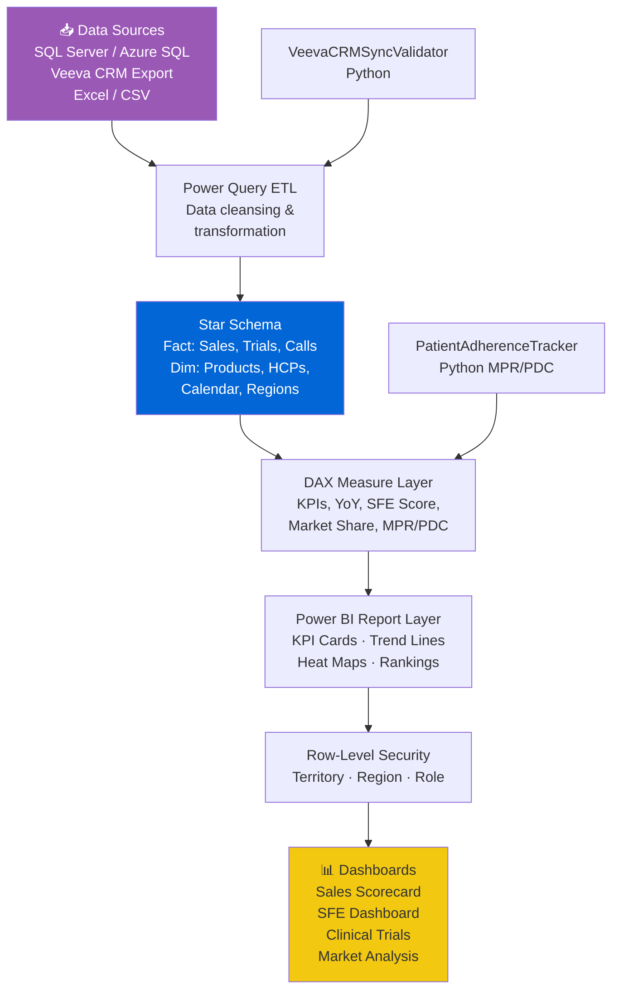

# 💊 Pharma BI Starter Kit

<p align="center">
  
  
  
  
  
  
  
</p>

> A production-ready starter kit for pharmaceutical BI teams building dashboards with Power BI and SQL. Includes DAX templates, T-SQL query patterns, and sample datasets for APAC pharma KPIs — from sales performance to clinical trial tracking. Built around IQVIA SFE methodology.

---

## 🎯 Features

- **HCP Targeting Optimizer** — LP-based call frequency optimization across HCP segments with scipy.optimize (IQVIA SFE methodology)
- **Sales Force Effectiveness (SFE)** — 5-dimension IQVIA APAC SFE scoring with A+/A/B/C/D tier classification
- **Power BI DAX Templates** — Pre-built measures for YoY growth, market share, SFE scoring, and clinical trial enrollment velocity
- **Patient Adherence Tracking** — MPR, PDC, and persistence analytics aligned with ISPOR standards
- **T-SQL Query Library** — Optimized queries for pharma data warehouses with Row-Level Security patterns
- **Veeva CRM Sync Validator** — 5-check data quality validation for CRM freshness, completeness, and duplication
- **Sample Datasets** — Synthetic pharma sales, HCP networks, competitor pricing, and clinical trial data
- **Data Governance Framework** — Metric definitions, calculation rules, and data dictionary templates
- **Row-Level Security (RLS)** — Territory-based access patterns for field sales vs management views

---

## 🚀 Quick Start

### Prerequisites

- Power BI Desktop (latest)
- SQL Server 2019+ or Azure SQL Database
- Python 3.9+ (for Python utility modules)

### Clone & Install

```bash
git clone https://github.com/achmadnaufal/pharma-bi-starter-kit.git
cd pharma-bi-starter-kit
pip install -r requirements.txt
```

### Load Sample Data (SQL Server)

```sql
USE [PharmaBIDemo]
GO

-- Create staging table
CREATE TABLE staging.pharma_sales (
    sale_id       INT PRIMARY KEY,
    product_name  NVARCHAR(100),
    therapeutic_area NVARCHAR(50),
    sale_date     DATE,
    sale_amount   DECIMAL(12,2),
    units_sold    INT,
    hcp_id        INT,
    region        NVARCHAR(50)
);

-- Load sample data
BULK INSERT staging.pharma_sales
FROM 'sample_data/sample-sales-data.csv'
WITH (FORMAT = 'CSV', FIRSTROW = 2);
```

### Key DAX Measures

```dax
-- Year-over-Year Sales Growth
Sales_YoY_Growth =
VAR CurrentSales = CALCULATE(SUM(Sales[sale_amount]),
    YEAR(Sales[sale_date]) = YEAR(TODAY()))
VAR PriorSales = CALCULATE(SUM(Sales[sale_amount]),
    YEAR(Sales[sale_date]) = YEAR(TODAY()) - 1)
RETURN DIVIDE(CurrentSales - PriorSales, PriorSales, 0)

-- Market Share by Therapeutic Area
Market_Share_Pct =
DIVIDE(SUM(Sales[sale_amount]),
    CALCULATE(SUM(Sales[sale_amount]), ALL(Sales[product_name])), 0)

-- SFE Call Quality Index
SFE_Call_Quality =
DIVIDE([Effective_Calls], [Total_Calls], 0) * 100
```

---

## 📐 Architecture



---

## 📊 Demo

See [`demo/sample_output.txt`](demo/sample_output.txt) for a full Q1 2026 APAC scorecard with sales rankings, SFE scoring, and regional breakdown.

```
📊 KPI SCORECARD — CARDIOVASCULAR PORTFOLIO (Q1 2026)
  Total Sales (USD)    : $4,218,500    ✅ vs $4,000,000 target (+5.5%)
  Market Share %       : 18.4%         ✅ vs 17.0% target (+1.4pp)
  YoY Growth           : +12.3%        ✅ vs +10.0% target
  SFE Score            : 78.2 / 100   ✅ Grade A (IQVIA benchmark)

  🏆 Top Product: Atorvastatin 20mg — $890,400 | +14.2% YoY
```

---

## 📂 Project Structure

```
pharma-bi-starter-kit/
├── src/
│   ├── sfe_scorer.py            # IQVIA 5-dimension SFE scoring
│   ├── patient_adherence.py     # MPR / PDC / persistence analytics
│   ├── veeva_validator.py       # CRM data quality checks
│   └── market_share.py          # Competitive market share utils
├── data/
│   ├── sample-sales-data.csv
│   ├── competitors-data.xlsx
│   └── clinical-trials.xlsx
├── examples/                    # End-to-end usage examples
├── sample_data/                 # Synthetic pharma datasets
├── tests/                       # pytest unit tests
├── requirements.txt
├── CHANGELOG.md
└── CONTRIBUTING.md
```

---

## 🔧 Key Modules

| Module | Description |
|--------|-------------|
| `HCPTargetingOptimizer` | LP-based call planning: HCP segmentation, ROI analysis, territory balancing, next-best-action |
| `SalesForceEffectivenessScorer` | 5-dimension IQVIA SFE scoring: call quality, frequency, coverage, conversion, reach |
| `PatientAdherenceTracker` | MPR, PDC, and treatment persistence analytics |
| `VeevaCRMSyncValidator` | 5-check quality validator: completeness, freshness, duplicates, frequency, sample accuracy |
| DAX Templates | 15+ measures: YoY, market share, enrollment velocity, COGS %, RLS patterns |
| SQL Scripts | Schema setup, ETL procedures, window function examples, territory queries |

---

## 📈 Supported KPIs

| KPI | Formula | Standard |
|-----|---------|---------|
| YoY Sales Growth | (Current - Prior) / Prior | Internal |
| Market Share % | Our Sales / Total Market | IMS/IQVIA |
| SFE Score | Weighted 5-dimension index | IQVIA APAC |
| MPR (Medication Possession Ratio) | Days Supply / Days in Period | ISPOR |
| PDC (Proportion of Days Covered) | Days Covered / Observation Period | ISPOR |
| Enrollment Velocity | Patients Enrolled / Days Elapsed | ICH E6 |

---

## 🧪 Testing

### Python Usage (HCP Targeting Optimizer)

```python
from src.hcp_targeting import HCPTargetingOptimizer, HCPProfile

optimizer = HCPTargetingOptimizer(total_call_capacity=200)
profiles = [
    HCPProfile(hcp_id="H001", specialty="Cardiology", region="Jawa Barat",
               patient_volume=200, current_share=15.0, potential_share=40.0,
               last_activity_days_ago=45, engagement_score=6.5, call_cost_usd=120),
    HCPProfile(hcp_id="H002", specialty="Cardiology", region="Jawa Barat",
               patient_volume=350, current_share=8.0, potential_share=35.0,
               last_activity_days_ago=60, engagement_score=4.2, call_cost_usd=120),
]
segments = optimizer.segment_hcps(profiles)
allocation = optimizer.optimize_reach(profiles, total_calls=200)
roi = optimizer.calculate_roi_per_segment(profiles)
action = optimizer.next_best_action(profiles[0])
print(f"Allocation: {allocation}")
```

```bash
pytest tests/ -v
```

---

## 📄 License

MIT License — see [LICENSE](LICENSE)

---

> Built by [Achmad Naufal](https://github.com/achmadnaufal) | Lead Data Analyst | Power BI · SQL · Python · GIS
