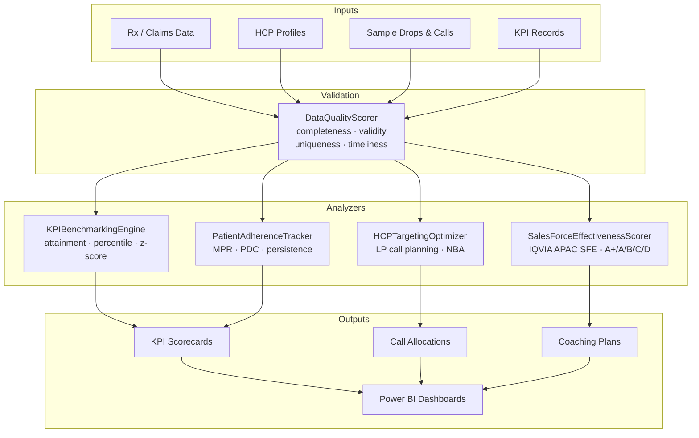

# Pharma BI Starter Kit

[](https://www.python.org/)
[](LICENSE)
[](https://github.com/achmadnaufal/pharma-bi-starter-kit/commits/main)

A starter kit / template for pharmaceutical BI analytics projects. Ships battle-tested Python modules for HCP targeting, sales force effectiveness scoring, KPI benchmarking, patient adherence tracking, and data quality scoring — plus Power BI DAX templates, T-SQL patterns, and synthetic sample datasets.

## Features

Every feature below corresponds to an actual module in [`src/`](src/):

- **HCP Targeting Optimizer** ([`src/hcp_targeting.py`](src/hcp_targeting.py)) — LP-based call-frequency optimization via `scipy.optimize.linprog`. Segments HCPs (high / medium / low potential), allocates calls under capacity constraints, estimates per-segment ROI, runs a territory balancer, and emits next-best-action recommendations.
- **Sales Force Effectiveness Scorer** ([`src/sales_force_effectiveness_scorer.py`](src/sales_force_effectiveness_scorer.py)) — 5-dimension IQVIA APAC SFE scoring (coverage, frequency, quality, NTB, attainment) with A+ / A / B / C / D tier classification and coaching recommendations.
- **KPI Benchmarking Engine** ([`src/kpi_benchmarking_engine.py`](src/kpi_benchmarking_engine.py)) — target-attainment distributions, percentile ranking, z-score outlier detection, and period-over-period index tracking against IQVIA reference benchmarks.
- **Patient Adherence Tracker** ([`src/patient_adherence_tracker.py`](src/patient_adherence_tracker.py)) — ISPOR-aligned MPR, PDC, persistence, refill-gap, and discontinuation analytics from pharmacy claim fills.
- **Data Quality Scorer** ([`src/data_quality_scorer.py`](src/data_quality_scorer.py)) — DAMA-DMBOK2 composite DQ scoring across completeness, validity, uniqueness, timeliness, and consistency.
- **Competitive Intelligence** ([`src/competitive_intel.py`](src/competitive_intel.py)) — competitor portfolio tracking, HHI concentration, pricing intelligence, and launch-timeline monitoring.
- **Pharma BI Core** ([`src/main.py`](src/main.py)) — `PharmaBIStarterKit` entrypoint for rep performance reports, territory heatmaps, SFE performance matrix, and KPI summary cards.
- **Sample datasets** ([`sample_data/`](sample_data/), [`data/`](data/)) — synthetic HCP profiles, rep performance, and NSP-quality samples for quick-start experimentation.

## Quick Start

```bash
git clone https://github.com/achmadnaufal/pharma-bi-starter-kit.git
cd pharma-bi-starter-kit
pip install -r requirements.txt
python demo/demo.py
```

Prerequisites: Python 3.9+. Power BI Desktop / SQL Server 2019+ are optional — only needed if you wire the DAX templates and T-SQL patterns into a dashboard.

## Architecture



## Usage

Run the end-to-end demo from the repo root:

```bash
python demo/demo.py
```

Real output from the current `HEAD`:

```
PHARMA BI STARTER KIT — LIVE DEMO
Repo root: /path/to/pharma-bi-starter-kit

============================================================
  HCP TARGETING OPTIMIZER (LP-based call planning)
============================================================
  HCPs analysed        : 5
  High-potential count : 2
  Medium-potential ct. : 3
  Low-potential count  : 0
  Total calls allocated: 40
  Top allocation (H003): 8 calls
  H001 next-best-action: detail_call

============================================================
  SALES FORCE EFFECTIVENESS SCORER (IQVIA APAC)
============================================================
  Rep                  : Ahmad Solikhin (REP_001)
  Composite SFE Score  : 73.1 / 100
  Tier                 : A
  Coverage pct         : 80.0%
  Revenue attainment   : 95.0%
  Top strength         : attainment

============================================================
  KPI BENCHMARKING ENGINE
============================================================
  Team                 : Cardiovascular APAC
  Reps evaluated       : 5
  Avg attainment       : 87.53%
  On-target reps       : 3 (60.0%)
  REP_003 percentile   : P100 (Top Performer)

============================================================
  PATIENT ADHERENCE TRACKER (MPR / PDC / Persistence)
============================================================
  Drug                 : Atorvastatin
  Patients analysed    : 3
  Mean PDC             : 0.61
  Mean MPR             : 0.61
  Adherent pct         : 33.3%
  Discontinued pct     : 0.0%
  Mean persistence     : 180.0 days

============================================================
  Demo complete.
============================================================
```

### Python API snippet — HCP Targeting

```python
from src.hcp_targeting import HCPProfile, HCPTargetingOptimizer

profiles = [
    HCPProfile("H001", "Cardiology", "Jawa Barat",
               patient_volume=350, current_share=15.0, potential_share=45.0,
               last_activity_days_ago=45, engagement_score=6.5),
    HCPProfile("H002", "Oncology", "Bangkok",
               patient_volume=480, current_share=22.0, potential_share=38.0,
               last_activity_days_ago=20, engagement_score=7.8),
]

optimizer = HCPTargetingOptimizer(total_call_capacity=40)
segments = optimizer.segment_hcps(profiles)
allocation = optimizer.optimize_reach(profiles, total_calls=40)
roi = optimizer.calculate_roi_per_segment(profiles, allocation)
nba = optimizer.next_best_action(profiles[0])
```

### Tests

```bash
pytest tests/ -v
```

## Tech Stack

- **Language:** Python 3.9+
- **Core libraries:** `pandas`, `numpy`, `scipy` (LP optimization), `duckdb`, `openpyxl`
- **UI / dashboards:** `streamlit`, `rich` CLI formatting, Power BI (DAX), SQL Server / Azure SQL (T-SQL)
- **Testing:** `pytest`
- **Methodology:** IQVIA APAC SFE, ISPOR Adherence Definitions, DAMA-DMBOK2 data quality, ZS Associates call-planning framework

## Project Structure

```
pharma-bi-starter-kit/
├── src/
│   ├── hcp_targeting.py                    # LP-based HCP call planning
│   ├── sales_force_effectiveness_scorer.py # IQVIA SFE scoring
│   ├── kpi_benchmarking_engine.py          # attainment · percentile · z-score
│   ├── patient_adherence_tracker.py        # MPR / PDC / persistence
│   ├── data_quality_scorer.py              # DAMA-DMBOK2 DQ scoring
│   ├── competitive_intel.py                # market share + HHI
│   ├── data_generator.py                   # synthetic data
│   └── main.py                             # PharmaBIStarterKit entrypoint
├── demo/
│   ├── demo.py                             # runnable end-to-end demo
│   └── sample_output.txt                   # sample dashboard snapshot
├── examples/basic_usage.py
├── sample_data/                            # synthetic CSV datasets
├── data/                                   # drop your real datasets here
├── tests/                                  # pytest unit tests
├── requirements.txt
├── CHANGELOG.md
└── CONTRIBUTING.md
```

## License

MIT — see [LICENSE](LICENSE).

---

> Built by [Achmad Naufal](https://github.com/achmadnaufal) | Lead Data Analyst | Power BI · SQL · Python · GIS
